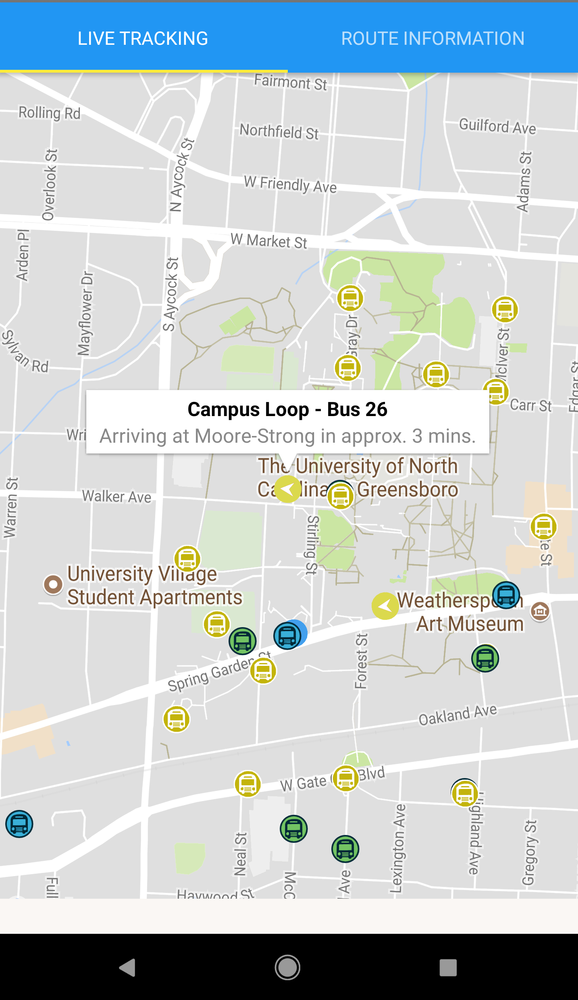

# UNCG Bus Tracker

A bus tracking app for the buses at UNCG. It shows the locations
of each bus in real time and provides ETAs for a when a bus should
arrive at each stop. Made in React Native.

## Why isn't it on the Play Store/App store??

Well, funny story. Turns out UNCG doesn't have enough buses for each
route they have. So some buses that are labeled as "Campus Loop" buses
actually go on other routes, and this could change each day.
This *shouldn't* be a problem because
the tablet in each bus allows the driver to update the route their
going, but UNCG doesn't enforce their drivers to update that information.
So, when my app colors a bus green for going on the
"Spartan Village" route, it might actually be going on the "Campus
Loop" route. It even still says their going a different route on the
physical bus, I have no idea how anyone can use the UNCG buses when
they don't know what route the bus is even going. This
also messes up the ETA estimations, as the app will see a "Campus Loop"
bus near a stop, but it's not actually going to the stop.

Because of this, I feel like people would blame my app for misreporting
the status of the bus because they wouldn't know about UNCG not
having their drivers properly update their status. So I just decided
to not put this app up.

It's sad, but the app does still work and does
it's job well if the bus actually went the route they were intended
to go, which is the case on some lucky days.
 Because of this, I decided to at least put it on github for
anyone else wanting to make a bus tracking app.

If you actually want a bus app for UNCG, don't worry! They are actually
going to be using NextBus at some point so watch out for that.
